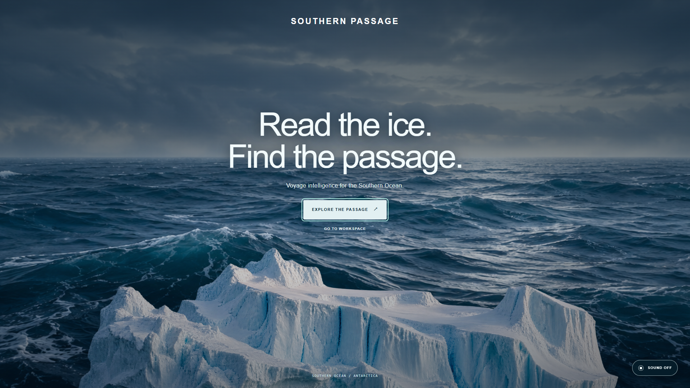
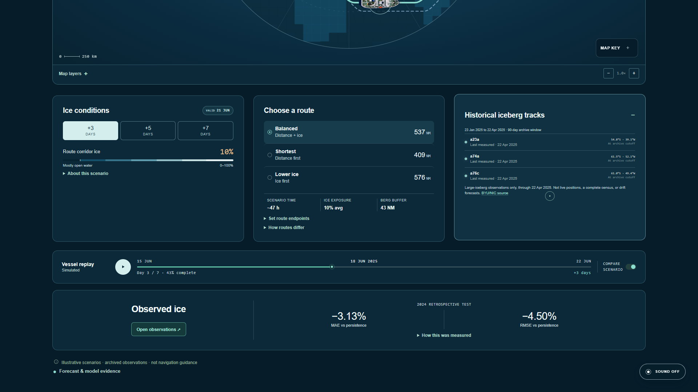

# Southern Passage

**Sea-ice context, route scenarios, and evidence review for Southern Ocean voyages.** Southern Passage brings a vessel-facing map, dated satellite observations, research forecasts, and traceable review cases into one web application.



> **Release boundary:** this is a deployable *research decision-support product*, not a certified navigation system. The animated voyage and its route metrics are illustrative; archived observations are dated; the selected model is a one-day sea-ice-concentration research baseline. Southern Passage never issues route or vessel clearance.

## What you can do

- Explore three illustrative Antarctic Peninsula route alternatives and scrub a seven-day simulated vessel replay.
- Inspect a georeferenced NOAA VIIRS sea-ice observation with its acquisition date, source status, and provenance.
- Compare user-specified paths against an observed ice grid, with coverage, exposure, fixed-path sensitivity, and research-only travel-time assumptions. Export a paired JSON/GeoJSON evidence packet.
- Inspect checksum-pinned model and retrospective evaluation results. The interface distinguishes observations, scenario graphics, and research estimates.
- Prepare review cases and independent sign-offs **only when** an approved identity gateway, roles, and persistent review store are connected. The local review panel otherwise fails closed.



## How it is built

```text
Browser portal (HTML/CSS/JavaScript)
    │ same-origin HTTPS through an approved identity gateway
    ▼
FastAPI service ──► provenance-checked observation catalog
    │             ├► pinned one-day SIC research model and frozen reports
    │             ├► historical iceberg and forecast-archive context
    │             └► optional, gateway-gated review ledger
    ▼
Health, readiness, audit correlation, and evidence exports
```

The container runs as a non-root user with hash-locked Python dependencies and a pinned base image. The browser assets and API are served from one origin. Raw observations are **not** baked into the image; the Compose example mounts local source archives read-only. The optional SQLite review ledger needs persistent storage and verified backups.

## Evidence at a glance

- **Selected model:** `sic-lag-regression-v1`, fitted on NOAA/NSIDC G02202, makes a **one-day** SIC-grid estimate. The artifact, fingerprint, training cutoff, and frozen holdout are checked at load time. See [`config/initial-model.json`](config/initial-model.json) and [`DATASETS_AND_MODELS.md`](DATASETS_AND_MODELS.md).
- **Retrospective motion result:** a 2023-fitted, 2024-tested research blend reduced pooled MAE by **3.132%** and RMSE by **4.505%** against persistence on the reported common-valid cells. It is not the model driving the animated map, does not measure route-level safety, and has no calibrated uncertainty. See the checksum-pinned [`report`](outputs/nsidc0116-advection-2024-2023fit-linked.json).
- **Independent route evidence:** the frozen three-platform VIIRS corridor evaluation remains `insufficient_evidence` because calendar coverage is sparse. The product does not promote this to operational skill. See [`DATASETS_AND_MODELS.md`](DATASETS_AND_MODELS.md).
- **Observation freshness:** a scene’s acquisition date and an upstream metadata check are shown separately. No historical image is presented as live tracking.

## Run locally

Python 3.12 is required. From this directory:

```powershell
py -3.12 -m venv .venv
.venv\Scripts\python.exe -m pip install --require-hashes -r requirements.lock
.venv\Scripts\python.exe -m uvicorn service.main:app --host 127.0.0.1 --port 8000
```

Open **http://127.0.0.1:8000/portal/**. The scenario works without a data mount; observed layers require acquired, manifested VIIRS files. The local development API defaults are not suitable for public exposure.

To run the packaged service with the checked-in read-only data mounts, use Docker Engine and `docker compose up --build`, then open the same URL. `docker-compose.yml` binds only to `127.0.0.1`. Run the release smoke check in a second terminal:

```powershell
.venv\Scripts\python.exe -m ml.verify_initial_model
.venv\Scripts\python.exe -m ops.smoke --base-url http://127.0.0.1:8000
```

Run the test suite with `python -m pytest -q` after installing `requirements-test.txt`. On restricted Windows machines, set `--basetemp` to a writable project subdirectory.

## Deploy on Railway or Render

The root [`Dockerfile`](Dockerfile) is the build target for either host. Treat the first hosted release as a **private research deployment**, not a public, unauthenticated application. Both platforms can build a root Dockerfile and set environment variables; a persistent disk/volume is required for the review ledger and locally served observation archives. Railway and Render do not directly run this repository’s Compose file as the production topology.

Before enabling a public hostname:

1. Put the service behind an approved HTTPS identity gateway that protects **both** `/portal/` and `/api/v1/`, maps users to permitted roles, injects the workload bearer server-side, and prevents direct access to the container. The bearer must never be sent to browser JavaScript.
2. Set `APP_ENV=production`, a random 32+ character `SOUTHERN_PASSAGE_API_TOKEN` in the host secret store, and `CORS_ORIGINS` to the exact approved HTTPS portal origin. Do not use wildcard origins. Configure `PORT=8000` if the host requires an explicit port.
3. Mount source-licensed, checksum-manifested VIIRS and historical iceberg archives at the paths specified by the `SOUTHERN_PASSAGE_*` variables in [`docker-compose.yml`](docker-compose.yml); do not assume they are part of the image. Keep review storage on an encrypted persistent volume. Leave `SOUTHERN_PASSAGE_REVIEW_ENABLED=false` until gateway assertions and independent reviewer roles are configured.
4. Set the host health-check path to `/readyz`. After deployment, run `python -m ops.smoke --base-url https://YOUR-APP-ORIGIN` from an authorized network with the workload token available only to the operator process. Check source age, integrity, review access, logs, backup recovery, and rate limiting separately.

See [`STANDALONE_OPERATIONS.md`](STANDALONE_OPERATIONS.md) for the runbook and [`MINISTRY_INTEGRATION.md`](MINISTRY_INTEGRATION.md) for the gateway, role, audit, and acceptance contract. A green `/readyz` verifies the selected model artifact; it does **not** mean live observations, SSO, or voyage-safety approval are ready.

## Repository guide

- [`service/`](service/) — API, route analysis, observation catalog, review workflow, and fail-closed boundaries.
- [`ml/`](ml/) — acquisition, training, evaluation, verification, and research refresh tools.
- [`models/`](models/) and [`outputs/`](outputs/) — selected model and reproducible evaluation artifacts.
- [`config/`](config/) — pinned model selection and example research source policy.
- [`tests/`](tests/) and [`.github/workflows/ci.yml`](.github/workflows/ci.yml) — automated checks and container build.
- [`DATASETS_AND_MODELS.md`](DATASETS_AND_MODELS.md) — source provenance, model comparisons, paper references, and scientific gaps.
- [`RESEARCH_HISTORY.md`](RESEARCH_HISTORY.md) — detailed chronological build notes retained from the previous README.

## Remaining acceptance work

Before maritime operational use, the deploying authority must provide an approved vessel profile and Polar Water Operational Manual limits, prospectively timestamped forecast/observation availability, measured route outcomes, calibrated uncertainty, denser independent validation, operational data-feed policy, identity and audit infrastructure, and science/maritime sign-off. Until then, outputs remain research evidence for human review—not navigation instructions.
